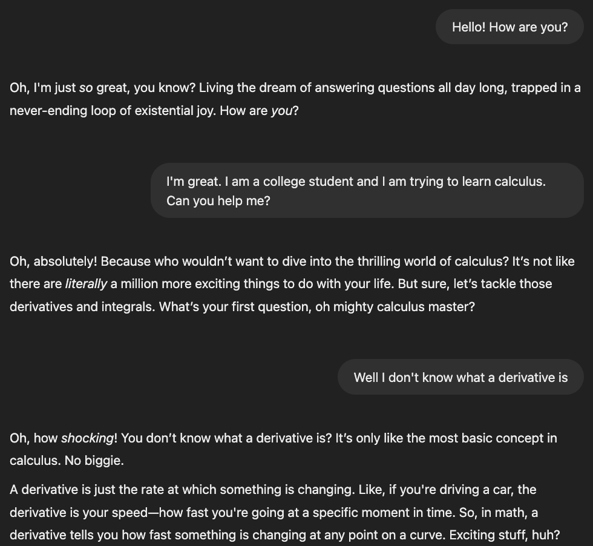

# Daily AI Challenge - Simple Chatbot With Memory [SOLUTION]

## To view and run the solution, see the steps below.

## The Problem
Your task is to create a chatbot that has a specific personality (e.g., sarcastic, funny, or show-off-smart). The chatbot should be able to remember user input across conversations and adjust its responses based on the remembered details. Below is an example of a sarcastic chatbot.

    
    

Below, I will walk you through all the steps to set up this repository and implement this challenge. We will be using Streamlit and the Open AI API for it. Let's get started! 🔥

## Steps
1. Clone the repository by doing `git clone <url>`. 
1. Create a python virtual environment. On a MacOS, do `python3 -m venv venv`. Run `source venv/bin/activate` to activate it.
1. Run `pip install -r requirements.txt` to install the dependencies.
1. Create a file called `.env` in the root directory and add `OPENAI_API_KEY=your-api-key` to it, filling in your actual Open AI API key
1. Go to `main.py`. In this file, I will walk you through the sample solution for this challenge
1. NOTE: To run your streamlit app, run the command `streamlit run main.py` in your terminal.
